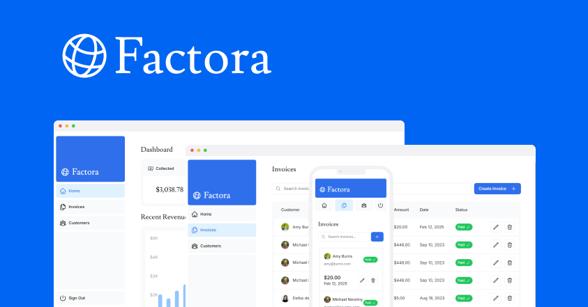

# Factora - Invoices Dashboard



Factora is a sleek and modern invoices dashboard built with **Next.js**, designed to help businesses manage their invoices efficiently. This project is brought to you by **Vercel**.

## 🚀 Features

- 📊 **Dashboard Overview** – Get a quick insight into your revenue, invoices, and customer data.
- 🔍 **Invoice Management** – Easily search, filter, and manage invoices.
- 📱 **Responsive Design** – Fully optimized for mobile, tablet, and desktop.
- 🎨 **Modern UI/UX** – Clean and intuitive interface with a professional look.
- ⚡ **Built with Next.js** – High performance and SEO-friendly.

## 🛠️ Tech Stack

- **Next.js** – React framework for production.
- **TypeScript** – Type-safe development.
- **Tailwind CSS** – Modern styling with utility classes.
- **Vercel** – Deployment and hosting.

## 📦 Installation

To run the project locally, follow these steps:

```bash
git clone https://github.com/Alkhawarizmi02/nextjs-dashboard.git
cd nextjs-dashboard
pnpm install  # or npm install / yarn install
pnpm dev      # or npm run dev / yarn dev

